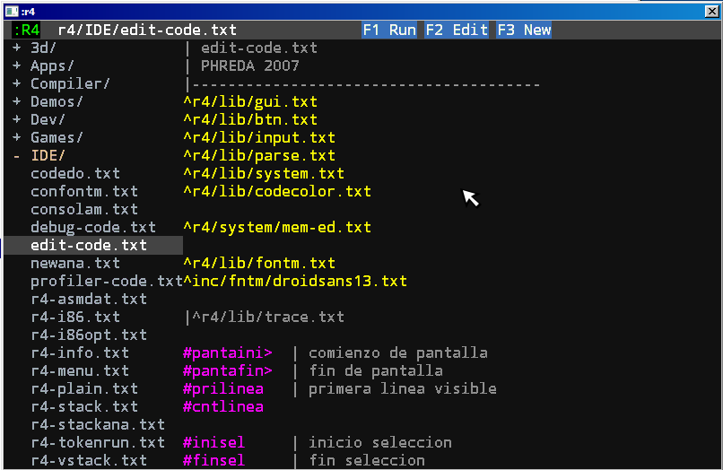

# Configuration

## Virtual Machine

:r4 has a VM for execute the programs, this program is made in C and has a compile to bytecode, a bytecode executer and graphics rutines.



When you run r4.exe the system, you can configure with line arguments or the file r4.ini.
The options for configuration file, are:

```
w<SCRW> windows width
h<SCRH>	windows height
b remove border in window

f fullscreen

s no start the screen (silent mode)

p<PRINTER NAME> set printer to name

c<FILECODE> compile code
i<IMAGEN> build bytecodes
x<IMAGEN> execute bytecodes

? help (line argument)
```

The basic configuration is screen size, you can choose a windows wiht `w1024 h600` or a fullscreen with `f`.

## The debug file

For compile to bytecodes you can call r4 from a console or a bat file and make the image. The file `compiledebug.bat` is:

```
r4 cr4/ide/edit-code.txt idebuga.r4x
```

This code make `debuga.r4x` with the bytecodes from compile `r4/ide/edit-code.txt`.

There are some special files in the interpreter: if main.r4x exist then load and execute (not need compile), if not, main.txt is load, compile and execute. if there are an error the vm call to debug.r4x program to see the error.

Every `run` in the code stack the file executed and call the name to compile and execute, when finish this code reload the previous one.

## Keyboard configuration

To read the status of the keys, the scancode is used, this value comes directly from the input hardware avoiding the modifications made by the OS. This decision enables that at some time it is possible to compile for a format that is bootable, totally avoiding the OS.

The difficulty that this decision has is that the different distributions of the keyboards is not reflected in the scancode, but this table must be calculated from this code. Therefore the equivalence tables the characters they generate are defined in the library: `lib/keyboard.txt`, the idea is uncomment the table used. Another difficulty is, the exe generated by the compiler has the keyboard layout in the code, however, it is possible to make a system that chooses the corresponding table according to the language of the OS


```

^r4/lib/key-es1.txt
|^r4/lib/key-us1.txt
|^r4/lib/key-fr1.txt
|^r4/lib/key-de1.txt

```

By default the key is spanish (my pc). You can change this comment line and use you keyboard distribution, if any key don't get the correct character, please send me a line or fix the map please, if you have another keyboard layout the same.
