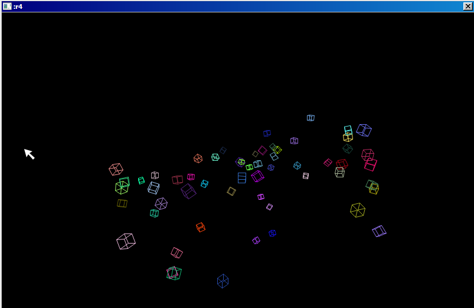

# 3d Math

:R4 has a 3d matrix stack for calculate points in 3d, in the similar way of opengl, you can make operation with this stack and then calculate point in 3d space.

The lib for make this is r4/llib/3dmat.txt

the var mati is not exported, is 4x4 matrix with the identity and continue in var mats with room for 20 levels.

```
#mati | matrix id
1.0 0 0 0		| 1.0 = $10000
0 1.0 0 0
0 0 1.0 0
0 0 0 1.0
#mats )( 1280 | 20 matrices
#:mat> 'mats

::matini
	'mats dup 'mat> ! 'mati 16 move ;

::mpush | --
	mat> dup 64 + dup 'mat> ! swap 16 move ;

::mpop | --
	mat> |'mats =? ( drop ; )
	64 - 'mat> ! ;

::nmpop | n --
	6 << mat> swap - |'mats <? ( 'mats nip )
	'mat> ! ;
```

The matrix is filled with pre or post multiply operations: translate, rotate and scale. Then you can transform any point with this matrix with `transform`

```
::mtrans | x y z -- ; post
::mtransi | x y z -- ; pre
::mscale | x y z -- ; post
::mscalei | x y z -- ; pre
::mrotx | x -- ; post
::mrotxi | x -- ; premultiplica
::mroty | y  -- ; post
::mrotyi | y -- ; pre
::mrotz | z -- ; post
::mrotzi | z -- ; pre

::transform | x y z -- x y z
::project3d | x y z -- u v
```

The matrix stack allows me to convert the local coordinates into screen coordinates by `transform`, the projection operation is performed by the `project3d`.

Make and example: first include the libs, use the particle system,  and define the camera position and a word for rotate the camera, see how make the mouse position in a rotation of the matrix.

```
^r4/lib/gui.txt
^r4/lib/3dmat.txt
^r4/lib/part16.txt

#xcam #ycam #zcam 50.0
#objetos 0 0	| finarray iniarray

:freelook
	xymouse
	sh 2/ - 7 << swap
	sw 2/ - neg 7 << swap
	neg mrotx mroty ;
```

Then make words for draw a wire cube, with size 1.0, from -0.5 to 0.5, 0,0,0 is the center of cube in local coordinates.

```
|----- draw cube -----
:3dop project3d op ;
:3dline project3d line ;

:drawboxz | z --
	-0.5 -0.5 pick2 3dop
	0.5 -0.5 pick2 3dline
	0.5 0.5 pick2 3dline
	-0.5 0.5 pick2 3dline
	-0.5 -0.5 rot 3dline ;

:drawlinez | x1 x2 --
	2dup -0.5 3dop 0.5 3dline ;

:drawcube |
	-0.5 drawboxz
	0.5 drawboxz
	-0.5 -0.5 drawlinez
	0.5 -0.5 drawlinez
	0.5 0.5 drawlinez
	-0.5 0.5 drawlinez ;
```

Of couse you can draw a 3d object here, with polygons or voxels, I go to this direction but not finish!, for now, we draw a cube.
We define randomize word for with diferent size:

```
|-----------------------
:r1 rand 1.0 mod ;
:r10 rand 10.0 mod ;
:r.1 rand 0.1 mod ;
:r.01 rand 0.01 mod ;
```

Now part of the magic: see how incv add velocity to position, in the structure of particles, the word draw1 draw the cube with matrix, this vector is place for every particle, can be diferent for every one!.

```
:incv b@+ b> 28 - +! ;

:draw1 | adr --
	>b
	mpush
	b@+ ink
	b@+ b@+ b@+ mtransi
	b@+ mrotxi b@+ mrotyi b@+ mrotzi
	incv incv incv
	incv incv incv
	drawcube
	mpop ;

:addobj
	'draw1 'objetos p!+ >a
	rand a!+
	0 0 0 a!+ a!+ a!+	| position
	r1 r1 r1 a!+ a!+ a!+	| rotation
	r.1 r.1 r.1 a!+ a!+ a!+ | vpos
	r.01 r.01 r.01 a!+ a!+ a!+ | vrot
	;
```

The main word.

```
:main
	mark
	10000 'objetos p.ini
	show clrscr

		omode
		freelook
		xcam ycam zcam mtrans

		'objetos p.draw

		[ 0.1 'zcam +! ; ] <up>
		[ -0.1 'zcam +! ; ] <dn>
		[ addobj ; ] <f1>
		'exit >esc<
		cminiflecha ;

: mm main ;
```

